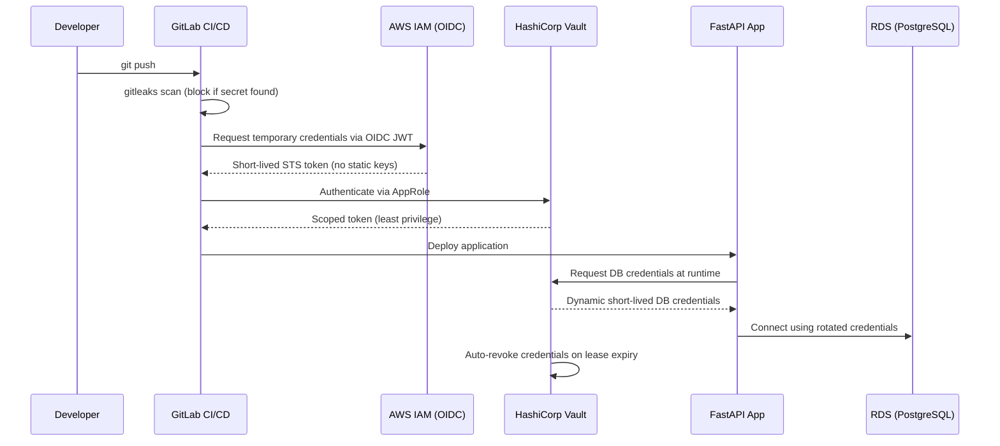

# 🛡️ Zero-Trust CI/CD Pipeline with Automated Secret Rotation


A CI/CD pipeline that eliminates static, long-lived credentials entirely — replacing them with GitLab OIDC federation to AWS IAM and dynamic, short-lived secrets from HashiCorp Vault.

---

## 🗺️ Roadmap & Current Status

This project is being developed iteratively. Below is the current implementation status:

- [x] **Stage 1: CI/CD Automation & Security Scanning** (Completed)
  - Automated secret detection with `gitleaks`.
  - Code linting and formatting via `ruff`.
  - Automated testing environment with `pytest` and caching.
- [x] **Stage 2: Vault Engine & AppRole Authentication** (Completed)
  - Configured HashiCorp Vault with short-TTL policies (example: 20m for CI tokens).
  - Implemented `approle-setup.sh` for zero-touch machine authentication.
  - Enforced Principle of Least Privilege (PoLP) via HCL policies.
- [ ] **Stage 3: Backend & Dynamic Database Secrets** (⏳ In Progress)
  - Integrate FastAPI with Vault SDK (`vault_client.py`).
  - Configure PostgreSQL dynamic secret engine.
- [ ] **Stage 4: Cloud Deployment via AWS OIDC** (⏳ Planned)
  - Implement passwordless AWS authentication for GitLab CI (`id_tokens`).
  - Provision IAM roles and infrastructure using Terraform.

---

## The Problem

Static AWS access keys stored in CI/CD variables are one of the most common root causes of cloud breaches — they don't expire, they're easy to leak in logs or misconfigured jobs, and once compromised, they grant standing access until someone notices. The same applies to database credentials hardcoded or copy-pasted into `.env` files across environments.

This project demonstrates a pipeline architecture where **no long-lived secret ever exists** — CI/CD authenticates to AWS via short-lived OIDC tokens, and the application fetches database credentials from Vault at runtime, valid only for the duration of the session.

---

## Architecture



---

## What This Project Demonstrates

- **OIDC federation** between GitLab CI/CD and AWS IAM — no static `AWS_ACCESS_KEY_ID` / `AWS_SECRET_ACCESS_KEY` anywhere in the pipeline.
- **Dynamic secrets** via Vault's database secrets engine — PostgreSQL credentials are generated per-session and auto-revoked on lease expiry.
- **Pre-commit + CI secret scanning** with gitleaks — commits containing secrets are blocked before they ever reach the remote.
- **Least-privilege access control** — Vault AppRole policies scope each CI job to only the secrets it needs.
- **Zero long-lived secret persistence** — no secrets are committed to Git or baked into image layers; runtime bootstrap files are short-lived and must be protected (chmod/ownership or Docker secrets).

---

## Quick Start (Local Setup)

Currently, the local environment is functional for testing Vault and the backend structure (Stages 1 & 2). The commands below are accurate for the provided Docker Compose and bootstrap scripts.

```bash
# 1. Clone the repository
git clone https://github.com/<your-username>/zero-trust-cicd-pipeline.git
cd zero-trust-cicd-pipeline

# 2. Prepare environment variables (use .env.example as a reference)
# Copy the example to the repository root (docker-compose reads .env from repo root)
cp .env.example .env
# Edit .env and set at minimum: POSTGRES_PASSWORD, PG_ADMIN_PASSWORD, VAULT_DEV_ROOT_TOKEN_ID, VAULT_ADDR

# 3. Start Vault (dev mode), Postgres, and the demo app locally
docker compose --profile dev up -d --build

# 4. Verify Vault is initialized and reachable (run the CLI inside the vault container)
# Note: the Vault binary may not be installed on the host — use the containerized CLI
docker compose --profile dev exec vault sh -c "VAULT_ADDR='http://127.0.0.1:8200' vault status"

# 5. Check the FastAPI application health
curl http://localhost:8000/health

# 6. Verify AppRole bootstrap file exists inside the app container
docker compose --profile dev exec app ls -l /bootstrap/app-approle.env
# To view the file (do NOT share secrets publicly):
# docker compose --profile dev exec app sh -c "cat /bootstrap/app-approle.env"

# 7. Run pre-commit secret scan locally
pre-commit run gitleaks --all-files
```

Full setup for OIDC federation and production-mode Vault is documented in [`docs/setup.md`](docs/setup.md) (work in progress).

---

## Security Highlights: Before / After

| Feature | Traditional Pipeline | This Project |
|---|---|---|
| **AWS Auth** | Static access keys in CI variables | Short-lived OIDC token, no stored keys |
| **DB Credentials**| Hardcoded in `.env` / config | Dynamic, generated per-session by Vault |
| **Secret Lifespan**| Indefinite until manually rotated | Minutes to hours, auto-revoked |
| **Leaked Commit** | Secret sits in git history forever | Blocked in CI (gitleaks) |
| **Access Scope** | Often broad / admin-level | Least-privilege via Vault policies & IAM roles |

---

## Repository Structure

```text
.
├── app/                  # FastAPI demo service — fetches DB creds from Vault at runtime
├── vault-config/         # Vault policies, AppRole config, secrets engine setup
├── terraform/            # IaC for AWS infrastructure (Planned)
├── .gitlab-ci.yml        # Pipeline: secret-scan → lint → test → deploy (OIDC)
├── docker-compose.yml    # Local dev stack (Vault + app + Postgres)
└── docs/
    ├── setup.md          # Full OIDC + Vault setup guide (WIP)
    └── architecture.md   # Detailed design decisions and threat model (WIP)
```

---

## Documentation

Detailed documentation is being written as the project evolves through its roadmap stages. The `docs/` folder contains WIP files for the production setup and architecture.

*   [Setup Guide](docs/setup.md)
*   [Architecture Decision Records (ADR)](docs/architecture.md)

---

## Known Limitations

- Vault currently runs in dev mode for local testing; production-mode with auto-unseal (AWS KMS) will be documented in later stages.
- No HA Vault cluster — single-node setup, sufficient for demonstrating the pattern but not production-scale.

---

## Helpful Links & Scripts

- `vault-config/auth/approle-setup.sh` — creates AppRole(s) and writes `app-approle.env` to the bootstrap directory.
- `vault-config/secrets-engines/database-setup.sh` — configures the Vault database secrets engine for PostgreSQL.
- `vault-config/scripts/init-dev.sh` — orchestrates the full dev bootstrap sequence.

---

## Contact

Built as part of a portfolio transitioning from Systems Administration into Cloud/DevSecOps Engineering.

[LinkedIn](#) · [GitHub](#)
