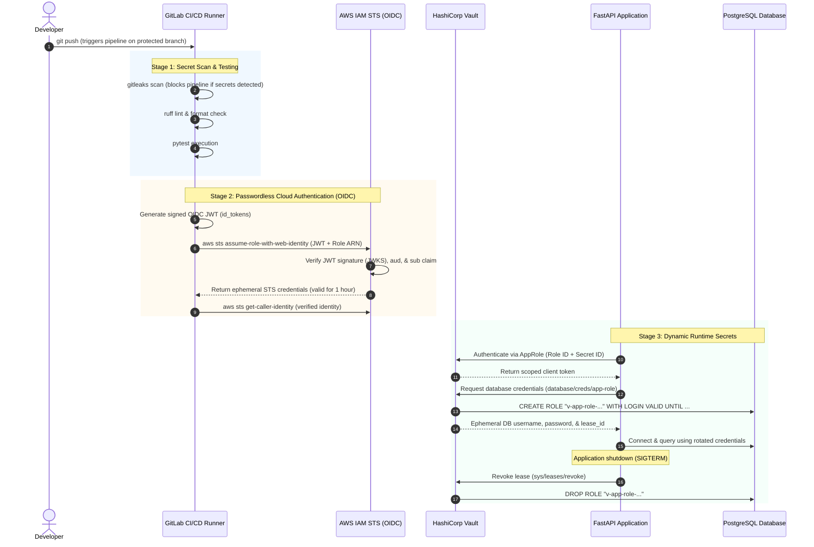

# 🛡️ Zero-Trust CI/CD Pipeline with Dynamic Secrets & AWS OIDC


An enterprise-grade DevSecOps pipeline and containerized cloud application that **completely eliminates static, long-lived credentials**.

By combining **GitLab CI OpenID Connect (OIDC) federation to AWS IAM** with **HashiCorp Vault dynamic database secrets**, this project ensures that no standing passwords or access keys ever persist in code repositories, CI/CD variables, or configuration files.

---

## 🗺️ Implementation Roadmap

All core stages of this Zero-Trust architecture are fully implemented and verified:

- [x] **Stage 1: CI/CD Automation & Security Scanning**
  - Shift-left secret detection with `gitleaks` (pre-commit hooks and CI stage).
  - Code quality, static analysis, and formatting enforcement with `ruff`.
  - Automated testing suite with `pytest` and cached dependencies.
- [x] **Stage 2: Vault Engine & AppRole Authentication**
  - HashiCorp Vault deployment configured with short-TTL access policies.
  - Machine-to-machine authentication via Vault AppRole (`approle-setup.sh`).
  - Principle of Least Privilege (PoLP) enforced through HCL access policies.
- [x] **Stage 3: Backend & Dynamic Database Secrets**
  - FastAPI service integrating Vault SDK (`hvac`) and PostgreSQL (`psycopg2`).
  - On-demand database credentials generated per session and revoked automatically on shutdown.
  - Liveness (`/health`) and dynamic credential readiness (`/ready`) probes.
- [x] **Stage 4: Cloud Deployment via AWS OIDC & Terraform**
  - Passwordless AWS authentication for GitLab CI utilizing ephemeral `id_tokens`.
  - Modular Terraform infrastructure (`terraform/modules/gitlab-oidc`) provisioning an IAM OIDC Provider and strictly scoped IAM Role without wildcards.
  - Verified end-to-end in GitLab CI (`aws-verify` stage).

---

## 🏛️ Architecture Overview

The pipeline implements an end-to-end Zero-Trust posture across both the CI/CD deployment lifecycle and runtime application services.



---

## 🔒 Security Highlights: Before vs. After

| Security Vector | Traditional Pipeline | This Zero-Trust Architecture |
|---|---|---|
| **AWS Cloud Auth** | Static `AWS_ACCESS_KEY_ID` & `AWS_SECRET_ACCESS_KEY` stored in CI variables. | **Ephemeral OIDC JWTs**. Temporary STS session tokens generated on-the-fly, valid for 1 hour. |
| **Database Passwords** | Plaintext credentials hardcoded in `.env`, Dockerfiles, or secrets managers. | **Dynamic secrets**. Unique DB credentials created on-demand per container, auto-expiring via Vault leases. |
| **Credential Lifespan** | Indefinite (often months or years until manual rotation). | **Minutes to 1 hour**. Auto-revoked upon container termination or lease expiry. |
| **Repository Leak Risk** | High. Compromised keys in commits or runner logs yield standing cloud access. | **Zero standing access**. Gitleaks scans git history; temporary tokens cannot be reused outside their strict context. |
| **Blast Radius** | Broad/Admin access across AWS accounts and full database schemas. | **Strictly scoped**. IAM Trust Policy restricts role assumption to a single repo & branch; Vault HCL restricts DB privileges. |
| **Auditability** | Difficult to attribute actions to specific CI jobs or application pods. | **Comprehensive audit trail**. Every STS session and Vault lease maps directly to a specific Git commit, job ID, and lease ID. |

---

## 📁 Repository Structure

```text
.
├── .gitlab-ci.yml                 # 4-stage pipeline: secret-scan → lint → test → aws-verify
├── .pre-commit-config.yaml        # Local shift-left security hooks (gitleaks)
├── .gitignore                     # Rigorous ignore rules for state, credentials, and local envs
├── docker-compose.yml             # Local dev stack (Vault dev mode, PostgreSQL, FastAPI app)
├── app/                           # FastAPI Application Service
│   ├── app/
│   │   ├── config.py              # Pydantic Settings loading environment configurations
│   │   ├── database.py            # Psycopg2 connection management and DB ping checks
│   │   ├── main.py                # App entrypoint with async lifespan (startup auth & shutdown revocation)
│   │   ├── vault_client.py        # HVAC client for AppRole auth, dynamic creds retrieval & lease revocation
│   │   └── routes/
│   │       └── health.py          # Liveness (/health) & Readiness (/ready) probes
│   ├── tests/
│   │   └── test_health.py         # Pytest suite with mock Vault/DB interfaces
│   ├── Dockerfile                 # Multi-stage non-root container configuration
│   ├── requirements.txt           # Pinned Python dependencies
│   └── .env.example               # Reference environment template for local development
├── vault-config/                  # Configuration-as-Code for HashiCorp Vault
│   ├── policies/
│   │   ├── app-read.hcl           # Least-privilege HCL policy (read DB creds, update lease revocation)
│   │   └── ci-deploy.hcl          # Policy scoped for deployment tasks
│   ├── secrets-engines/
│   │   └── database-setup.sh      # Automates PostgreSQL secrets engine, dynamic role creation & drop statements
│   └── scripts/
│       └── init-dev.sh            # Orchestrates Vault bootstrap, AppRole creation, and volume credentials
├── terraform/                     # Infrastructure-as-Code for AWS OIDC Federation
│   ├── modules/
│   │   └── gitlab-oidc/           # Reusable Terraform module
│   │       ├── main.tf            # Provisions AWS IAM OIDC Provider & IAM Role with strict Trust Policy
│   │       ├── variables.tf       # Validated input parameters (rejects wildcards & admin access)
│   │       ├── outputs.tf         # Exports Role ARN, Provider URL, and sub claim assertions
│   │       └── versions.tf        # Pins provider constraints (AWS >= 5.0, Terraform >= 1.6)
│   └── environments/
│       └── dev/                   # Environment-specific root configuration
│           ├── main.tf            # Module instantiation for dev environment
│           ├── variables.tf       # Environment defaults
│           └── terraform.tfvars.example  # Sample variable definitions
├── scripts/
│   └── docker-check.sh            # Automated verification script for local Docker Compose stack
└── docs/                          # Architectural Decision Records (ADRs) & documentation
```

---

## 🚀 Quick Start (Local Runbook)

You can spin up and inspect the entire Zero-Trust runtime stack locally using Docker Compose.

### Prerequisites
- [Docker Engine](https://docs.docker.com/engine/install/) and [Docker Compose v2](https://docs.docker.com/compose/)
- `curl`

### 1. Environment Setup
Copy the sample environment file to the repository root:
```bash
cp app/.env.example .env
```
*(Optional: Customize passwords or tokens inside `.env` if desired; defaults are pre-configured for local testing).*

### 2. Start the Local Infrastructure
Spin up Vault (in dev mode), PostgreSQL, the bootstrap automation container, and the FastAPI application:
```bash
docker compose --profile dev up -d --build
```

### 3. Verify Container Status
Ensure all services are running and healthy:
```bash
docker compose --profile dev ps
```
You should see:
- `vault` (healthy)
- `postgres` (healthy)
- `vault-init` (completed / exited 0)
- `app` (healthy on port 8000)

### 4. Test Health & Dynamic Database Connectivity
- **Liveness Probe** (verifies web server is running):
  ```bash
  curl -s http://localhost:8000/health
  # Expected: {"status":"ok"}
  ```

- **Readiness Probe** (verifies dynamic Vault credential generation & PostgreSQL connection):
  ```bash
  curl -s http://localhost:8000/ready
  # Expected: {"status":"ready","database":"connected"}
  ```

### 5. Inspect Vault Status & Generated Leases
Execute Vault commands inside the running container to inspect the database engine and lease allocations:
```bash
docker compose --profile dev exec vault sh -c "VAULT_ADDR='http://127.0.0.1:8200' vault status"
docker compose --profile dev exec vault sh -c "VAULT_ADDR='http://127.0.0.1:8200' vault list sys/leases/lookup/database/creds/app-role"
```

### 6. Run Automated Verification Harness
Run the provided automated verification test script:
```bash
chmod +x scripts/docker-check.sh
./scripts/docker-check.sh
```

### 7. Teardown
To cleanly stop containers and remove persistent volumes:
```bash
docker compose --profile dev down -v
```

---

## ☁️ Cloud Deployment: AWS OIDC with Terraform

The pipeline authenticates to AWS without static access keys via OpenID Connect (OIDC).

### How Trust is Established
1. **Terraform Provisions the Identity Provider & Role:**
   The `terraform/modules/gitlab-oidc` module registers `https://gitlab.com` as an OIDC Identity Provider in AWS IAM and creates an IAM Role whose Trust Policy enforces exact conditions:
   ```hcl
   condition {
     test     = "StringEquals"
     variable = "gitlab.com:aud"
     values   = ["https://gitlab.com"]
   }
   condition {
     test     = "StringEquals"
     variable = "gitlab.com:sub"
     values   = ["project_path:kahtavyi/zero-trust-cicd-pipeline:ref_type:branch:ref:main"]
   }
   ```
   *No wildcards (`*`) are permitted in the `sub` claim or action definitions, ensuring that no other GitLab repository or unauthorized branch can assume this role.*

2. **Deploying the Terraform Module:**
   ```bash
   cd terraform/environments/dev
   cp terraform.tfvars.example terraform.tfvars
   terraform init
   terraform plan
   terraform apply
   ```
   Upon completion, Terraform outputs the generated IAM Role ARN:
   ```text
   gitlab_ci_role_arn = "arn:aws:iam::821589437117:role/zt-cicd-dev-gitlab-ci-role"
   ```

3. **GitLab CI/CD Integration:**
   The following variables are configured in **GitLab Project → Settings → CI/CD → Variables**:
   - `AWS_ROLE_ARN`: `arn:aws:iam::<ACCOUNT_ID>:role/zt-cicd-dev-gitlab-ci-role` (Protected: `true`, Masked: `true`)
   - `AWS_REGION`: `us-east-1`

4. **Runtime Pipeline Execution:**
   In `.gitlab-ci.yml`, the `aws_oidc_verify` stage requests an OIDC token and assumes the role:
   ```yaml
   aws_oidc_verify:
     stage: aws-verify
     image:
       name: amazon/aws-cli:2.22.0
       entrypoint: [""]
     id_tokens:
       AWS_OIDC_TOKEN:
         aud: "https://gitlab.com"
     rules:
       - if: '$CI_COMMIT_BRANCH == "main"'
     script:
       - echo "${AWS_OIDC_TOKEN}" > /tmp/oidc-token.jwt
       - CREDS=$(aws sts assume-role-with-web-identity \
           --role-arn "${AWS_ROLE_ARN}" \
           --role-session-name "gitlab-ci-${CI_JOB_ID}" \
           --web-identity-token file:///tmp/oidc-token.jwt \
           --duration-seconds 3600 \
           --region "${AWS_REGION}" \
           --query '[Credentials.AccessKeyId, Credentials.SecretAccessKey, Credentials.SessionToken, Credentials.Expiration]' \
           --output text)
       - export AWS_ACCESS_KEY_ID=$(echo "${CREDS}" | awk '{print $1}')
       - export AWS_SECRET_ACCESS_KEY=$(echo "${CREDS}" | awk '{print $2}')
       - export AWS_SESSION_TOKEN=$(echo "${CREDS}" | awk '{print $3}')
       - aws sts get-caller-identity --region "${AWS_REGION}"
   ```

---

## 👨‍💻 About the Author

This project was conceived, architected, and built as a core portfolio project demonstrating advanced practical competencies in **DevSecOps**, **Cloud Security Engineering**, and **Infrastructure-as-Code (IaC)**.

It reflects a dedicated professional transition from **Systems Administration** to **Cloud & DevSecOps Engineering**, bridging foundational operating system, networking, and container administration with modern Zero-Trust cloud architectures and automated security gates.

- **Author:** Nazar Kahtavyi
- **Focus Areas:** Cloud Security, DevSecOps, Infrastructure-as-Code, CI/CD Hardening, Identity & Secrets Governance
- **GitHub:** [@kahtavyi](https://github.com/kahtavyi)
- **GitLab:** [@kahtavyi](https://gitlab.com/kahtavyi)

---

## 📄 License

This repository is licensed under the [MIT License](LICENSE).
