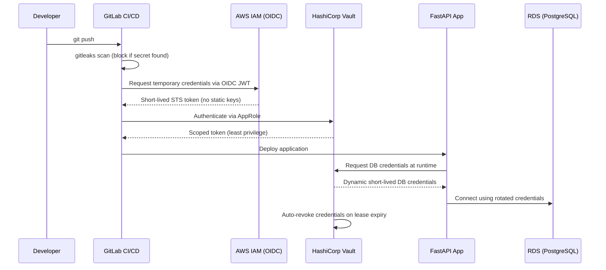

# Zero-Trust CI/CD Pipeline with Automated Secret Rotation


A CI/CD pipeline that eliminates static, long-lived credentials entirely — replacing them with GitLab OIDC federation to AWS IAM and dynamic, short-lived secrets from HashiCorp Vault.

---

## The Problem

Static AWS access keys stored in CI/CD variables are one of the most common root causes of cloud breaches — they don't expire, they're easy to leak in logs or misconfigured jobs, and once compromised, they grant standing access until someone notices. The same applies to database credentials hardcoded or copy-pasted into `.env` files across environments.

This project demonstrates a pipeline architecture where **no long-lived secret ever exists** — CI/CD authenticates to AWS via short-lived OIDC tokens, and the application fetches database credentials from Vault at runtime, valid only for the duration of the session.

---

## Architecture



---

## What This Project Demonstrates

- **OIDC federation** between GitLab CI/CD and AWS IAM — no static `AWS_ACCESS_KEY_ID` / `AWS_SECRET_ACCESS_KEY` anywhere in the pipeline
- **Dynamic secrets** via Vault's database secrets engine — RDS credentials are generated per-session and auto-revoked on lease expiry
- **Pre-commit + CI secret scanning** with gitleaks — commits containing secrets are blocked before they ever reach the remote
- **Least-privilege access control** — Vault AppRole policies scope each CI job to only the secrets it needs
- **Audit logging** — every secret access is logged and traceable to a specific pipeline run
- **Zero secret persistence** — no secret is written to disk, environment files, or Docker image layers

---

## Quick Start

```bash
# Clone the repository
git clone https://github.com/<your-username>/zero-trust-cicd-vault.git
cd zero-trust-cicd-vault

# Start Vault (dev mode) and the demo app locally
docker-compose up -d

# Verify Vault is unsealed and reachable
docker exec -it vault vault status

# Run the pre-commit secret scan manually
pre-commit run gitleaks --all-files
```

Full setup for OIDC federation and production-mode Vault is documented in [`docs/setup.md`](docs/setup.md).

---

## Security Highlights: Before / After

| | Traditional Pipeline | This Project |
|---|---|---|
| AWS auth | Static access keys in CI variables | Short-lived OIDC token, no stored keys |
| DB credentials | Hardcoded in `.env` / config | Dynamic, generated per-session by Vault |
| Secret lifespan | Indefinite until manually rotated | Minutes to hours, auto-revoked |
| Leaked commit | Secret sits in git history forever | Blocked pre-commit and in CI (gitleaks) |
| Access scope | Often broad / admin-level | Least-privilege via Vault policies & IAM roles |
| Audit trail | Manual, inconsistent | Every access logged by Vault |

---

## Repository Structure

```
.
├── app/                  # FastAPI demo service — fetches DB creds from Vault at runtime
├── vault-config/         # Vault policies, AppRole config, secrets engine setup
├── .gitlab-ci.yml        # Pipeline: lint → gitleaks → OIDC auth → deploy
├── docker-compose.yml    # Local dev stack (Vault + app + Postgres)
├── .pre-commit-config.yaml
└── docs/
    ├── setup.md          # Full OIDC + Vault production setup guide
    └── architecture.md   # Detailed design decisions and threat model
```

---

## Roadmap / Known Limitations

- Vault currently runs in dev mode for local testing; production-mode with auto-unseal (AWS KMS) is documented but not yet automated
- Secret rotation is tested for RDS; extending dynamic secrets to other services (e.g., third-party APIs) is a planned next step
- No HA Vault cluster — single-node setup, sufficient for demonstrating the pattern but not production-scale
- Alerting on failed auth attempts is logged but not yet wired to a notification channel (SNS/Slack planned)

---

## Contact

Built as part of a portfolio transitioning from Systems Administration into Cloud/DevSecOps Engineering.

[LinkedIn](#) · [GitHub](#)
